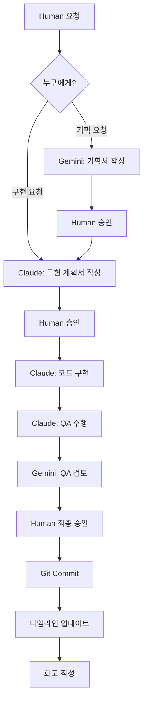

# AI Collaboration Workflow

> Claude와 Gemini가 체계적으로 협업하기 위한 워크플로우 가이드

---

## 📁 폴더 구조

```
.ai-workflow/
├── README.md                          # 이 파일 (전체 가이드)
├── TIMELINE.md                        # 전체 작업 타임라인
├── START_CLAUDE.md                    # ⭐️ Claude 간편 시작 (추천)
├── START_GEMINI.md                    # ⭐️ Gemini 간편 시작 (추천)
├── PROMPT_CLAUDE.md                   # Claude용 상세 가이드
├── PROMPT_GEMINI.md                   # Gemini용 상세 가이드
├── aliases.sh                         # 터미널 alias 설정 파일
├── plans/                             # 기획서 및 구현 계획서
│   ├── _TEMPLATE.md                   # 계획서 템플릿
│   └── YYYY-MM-DD-HHMM-task.md       # 실제 계획서들
├── reviews/                           # 리뷰 문서 (필요시)
├── qa/                                # QA 리포트
│   ├── _TEMPLATE.md                   # QA 리포트 템플릿
│   └── YYYY-MM-DD-HHMM-task.md       # 실제 QA 리포트들
├── reports/                           # 기타 보고서 (필요시)
└── retrospectives/                    # 회고 문서
    └── CURRENT_SPRINT.md              # 현재 스프린트 회고
```

---

## 🔄 전체 워크플로우



---

## 👥 역할 분담

### 🔵 Gemini (기획자 & 리뷰어)
- ✅ 기능 기획서 작성
- ✅ Claude의 구현 계획 검토
- ✅ Claude의 코드 리뷰 (필요시)
- ✅ Claude의 QA 리포트 검토
- ✅ 타임라인 관리
- ✅ 회고 작성

### 🟢 Claude (구현자 & QA)
- ✅ 구현 계획서 작성
- ✅ 코드 구현
- ✅ QA 수행 및 리포트 작성
- ✅ Git 커밋
- ✅ 회고 작성

### 🟡 Human (의사결정자)
- ✅ 계획서 승인/거부
- ✅ QA 리포트 승인/거부
- ✅ 최종 커밋 승인
- ✅ 분쟁 중재

---

## 🚀 사용 방법

### 1. 기획이 필요한 경우

```bash
# 1. Gemini 세션 시작
gemini

# 2. Gemini에게 프롬프트 제공
cat .ai-workflow/PROMPT_GEMINI.md

# 3. 기획 요청
"[기능명] 기능 기획해줘."

# 4. Gemini가 능동적으로 승인 요청
→ Gemini가 기획서를 작성하고 자동으로 Human에게 승인 요청
→ Human은 "예" 또는 "수정 필요: [의견]"으로 응답

# 5. Claude 세션 시작
claude

# 6. Claude에게 프롬프트 제공
cat .ai-workflow/PROMPT_CLAUDE.md

# 7. 구현 계획 요청
"Gemini가 작성한 [기획 파일]을 보고 구현 계획 세워줘."
```

### 2. 바로 구현이 필요한 경우

```bash
# 1. Claude 세션 시작
claude

# 2. Claude에게 프롬프트 제공
cat .ai-workflow/PROMPT_CLAUDE.md

# 3. 구현 계획 및 구현 요청
"[기능명] 구현해줘."

# 4. Claude가 능동적으로 계획서 승인 요청
→ Claude가 구현 계획서를 작성하고 자동으로 Human에게 승인 요청
→ Human은 "예" 또는 "수정 필요: [의견]"으로 응답

# 5. Claude가 구현 진행
→ 승인 받으면 Claude가 자동으로 코드 작성 시작

# 6. Claude가 QA 수행 후 능동적으로 승인 요청
→ Claude가 QA 리포트를 작성하고 자동으로 Human에게 승인 요청
→ Human은 "예" 또는 "재작업 필요: [의견]"으로 응답

# 7. (선택) Gemini QA 검토
gemini
"Claude의 QA 리포트 검토해줘."
→ Gemini가 검토 후 Human에게 승인/거부 권고

# 8. Claude가 Git 커밋 및 회고
→ 승인 받으면 Claude가 자동으로 커밋하고 회고 작성
```

---

## ✅ Human 승인 체크포인트

> **중요**: AI가 능동적으로 Human에게 승인을 요청합니다.
> Human은 AI가 요청하면 "예/아니오" 또는 수정 의견을 주면 됩니다.

### 🔴 필수 승인 지점

1. **계획서 승인** (Gemini 또는 Claude 작성)
   - **AI 행동**: 계획서 작성 후 자동으로 Human에게 승인 요청
   - **Human 응답**: "예" 또는 "수정 필요: [의견]"
   - 파일: `.ai-workflow/plans/[파일명].md`
   - 확인 사항: 작업 범위, 변경 파일, 구현 내용, 테스트 계획

2. **QA 리포트 승인** (Claude 작성)
   - **AI 행동**: QA 리포트 작성 후 자동으로 Human에게 승인 요청
   - **Human 응답**: "예" 또는 "재작업 필요: [의견]"
   - 파일: `.ai-workflow/qa/[파일명].md`
   - 확인 사항: 테스트 결과, 발견된 이슈, 커밋 메시지

### 🟡 선택 승인 지점

3. **Gemini의 계획 검토** (기획이 있는 경우)
   - **AI 행동**: Claude 계획 검토 후 Human에게 승인/수정 권고
   - **Human 응답**: 최종 결정

4. **Gemini의 QA 검토** (더 엄격한 품질 관리를 원할 때)
   - **AI 행동**: Claude QA 검토 후 Human에게 승인/재작업 권고
   - **Human 응답**: 최종 결정

---

## 📋 파일명 규칙

### 계획서
```
.ai-workflow/plans/YYYY-MM-DD-HHMM-작업명.md
예: .ai-workflow/plans/2026-01-14-1030-login-component.md
```

### QA 리포트
```
.ai-workflow/qa/YYYY-MM-DD-HHMM-작업명.md
예: .ai-workflow/qa/2026-01-14-1130-login-component.md
```

### 리뷰 문서 (필요시)
```
.ai-workflow/reviews/YYYY-MM-DD-HHMM-review.md
예: .ai-workflow/reviews/2026-01-14-1045-api-design-review.md
```

---

## 🎯 Git Commit 규칙

### 커밋 메시지 형식

```bash
[type]: [제목]

[상세 설명]

QA: .ai-workflow/qa/YYYY-MM-DD-HHMM-task.md
```

### Type 종류
- `feat`: 새로운 기능 추가
- `fix`: 버그 수정
- `refactor`: 코드 리팩토링
- `style`: 스타일 변경 (코드 동작 변경 없음)
- `docs`: 문서 수정
- `test`: 테스트 코드 추가/수정
- `chore`: 빌드, 설정 파일 수정

### 예시

```bash
git commit -m "feat: 로그인 컴포넌트 구현

- 이메일/비밀번호 입력 폼 추가
- 유효성 검사 구현
- API 연동 완료

QA: .ai-workflow/qa/2026-01-14-1130-login-component.md
"
```

---

## 🔄 회고 작성 시점

### Claude
- 코드 구현 완료 후
- QA 수행 후
- Git 커밋 후

### Gemini
- 기획서 작성 후
- Claude 계획 검토 후
- QA 리포트 검토 후

### 형식
```markdown
### YYYY-MM-DD HH:MM - [작업명]
**Agent:** [Claude/Gemini]

#### 👍 Keep (계속 할 것)
- [좋았던 점]

#### 🤔 Problem (문제점)
- [개선이 필요한 점]

#### 💡 Try (시도할 것)
- [다음에 시도해볼 것]
```

---

## 🚫 주의사항

### Claude
- ❌ 계획서 없이 코드 작성 금지
- ❌ Human 승인 없이 진행 금지
- ❌ QA 없이 커밋 금지
- ❌ 타임라인 업데이트 누락 금지

### Gemini
- ❌ Claude 계획서 미검토 상태로 승인 금지
- ❌ QA 리포트 미검토 상태로 커밋 허용 금지
- ❌ 타임라인 업데이트 누락 금지
- ❌ 회고 작성 누락 금지

### Human
- ❌ 계획서 미확인 상태로 구현 진행 금지
- ❌ QA 리포트 미확인 상태로 커밋 금지

---

## 📊 스프린트 관리

### 스프린트 시작
1. `retrospectives/CURRENT_SPRINT.md` 초기화
2. Sprint Period 작성
3. 목표 설정

### 스프린트 종료
1. CURRENT_SPRINT.md를 `retrospectives/SPRINT_YYYY-MM-DD.md`로 복사
2. 새 CURRENT_SPRINT.md 생성
3. 통계 정리
4. 다음 스프린트 목표 설정

---

## 🆘 문제 발생 시

### Claude와 Gemini 의견 충돌
1. 각자의 근거를 문서에 명확히 작성
2. Human에게 중재 요청
3. Human의 결정을 따름

### QA 실패
1. 발견된 이슈를 QA 리포트에 상세히 작성
2. Status를 🔴 Fail로 변경
3. 수정 후 다시 QA 수행
4. 새 QA 리포트 작성

### 계획 변경 필요
1. 변경 사유를 계획서에 기록
2. 새 계획서 작성 또는 기존 계획서 수정
3. Human 재승인 요청

---

## 🔄 역할 체크 시스템

> AI들은 잘못된 요청을 받으면 자동으로 역할을 체크하고 올바른 AI를 안내합니다.

### Claude의 역할
- ✅ 코드 구현 (파일 작성, 수정, 삭제)
- ✅ 구현 계획서 작성
- ✅ 테스트 코드 작성
- ✅ QA 수행 및 리포트 작성
- ✅ Git 커밋

**잘못된 요청 예시:**
- "Claude, 로그인 기능 기획해줘" → Claude가 자동으로 "이건 Gemini 역할입니다"라고 안내

### Gemini의 역할
- ✅ 기능 기획서 작성
- ✅ 사용자 스토리 작성
- ✅ UX/UI 디자인 기획
- ✅ Claude 계획서 검토
- ✅ Claude QA 리포트 검토

**잘못된 요청 예시:**
- "Gemini, Login.jsx 파일 작성해줘" → Gemini가 자동으로 "이건 Claude 역할입니다"라고 안내

---

## 📎 유용한 명령어

```bash
# 전체 타임라인 확인
cat .ai-workflow/TIMELINE.md

# 최근 계획서 5개 확인
ls -lt .ai-workflow/plans/ | head -6

# 최근 QA 리포트 5개 확인
ls -lt .ai-workflow/qa/ | head -6

# 현재 회고 확인
cat .ai-workflow/retrospectives/CURRENT_SPRINT.md

# Claude 프롬프트 보기
cat .ai-workflow/PROMPT_CLAUDE.md

# Gemini 프롬프트 보기
cat .ai-workflow/PROMPT_GEMINI.md
```

---

## 🎓 세션 시작 방법 (3가지 옵션)

### ⭐️ 방법 1: 간편 시작 (추천)
매번 프롬프트를 읽을 필요 없이 요약본만 읽으면 됩니다.

**Claude 세션:**
```bash
claude
> "cat .ai-workflow/START_CLAUDE.md"
# 또는 터미널 alias 설정 후:
> "claude-start"
```

**Gemini 세션:**
```bash
gemini
> "cat .ai-workflow/START_GEMINI.md"
# 또는 터미널 alias 설정 후:
> "gemini-start"
```

### 방법 2: 터미널 Alias 설정 (최고 편함)
`.zshrc` 또는 `.bashrc`에 다음 줄 추가:

```bash
source /Users/jeanne/BADA-Report/.ai-workflow/aliases.sh
```

그 후 터미널 재시작하면:
- `claude-start` - Claude 워크플로우 시작
- `gemini-start` - Gemini 워크플로우 시작
- `ai-timeline` - 타임라인 확인
- `ai-plans` - 최근 계획서 확인
- `ai-qa` - 최근 QA 확인
- `ai-help` - 전체 가이드

### 방법 3: 전체 프롬프트 읽기 (상세)
처음 사용하거나 전체 내용이 필요할 때:

**Claude 세션:**
```bash
claude
> "cat .ai-workflow/PROMPT_CLAUDE.md"
```

**Gemini 세션:**
```bash
gemini
> "cat .ai-workflow/PROMPT_GEMINI.md"
```

---

## 🚀 빠른 시작 예시

```bash
# 1. Claude 세션 시작
claude

# 2. 간편 시작
cat .ai-workflow/START_CLAUDE.md

# 3. 작업 요청
"로그인 기능 구현해줘"

# Claude가 자동으로:
# - 타임라인 확인
# - 계획서 작성
# - Human에게 승인 요청
```

---

## 📞 지원

문제가 있거나 개선 제안이 있으면 `.ai-workflow/retrospectives/CURRENT_SPRINT.md`의 "Problem" 섹션에 기록해주세요.

---

**Happy Collaborating! 🚀**
