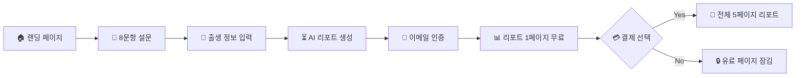

# 🌊 BADA - Operating Pattern Assessment Platform

> **B**ehavioral **A**ssessment & **D**eep **A**nalysis

BADA는 심리학적 평가와 한국 전통 점성술(사주팔자)을 결합한 자기발견 웹 애플리케이션입니다. 8가지 운영 패턴 설문조사를 통해 사용자의 깊은 내면을 분석하고, AI가 생성한 개인화된 인사이트를 제공합니다.

---

## ✨ 주요 기능

- **🧭 8문항 성격 분석**: 간단하지만 심층적인 운영 패턴 진단
- **🔮 사주팔자 기반 AI 리포트**: 전통 점성술과 현대 AI의 만남
- **🌊 오션 테마 디자인**: 직관적이고 아름다운 사용자 경험
- **💎 프리미엄 모델**: 1페이지 무료, 전체 리포트 유료 ($2.99)
- **📱 반응형 디자인**: 모든 디바이스에서 완벽한 경험

---

## 🚀 빠른 시작

### 1. 의존성 설치
```bash
npm install
```

### 2. 환경 변수 설정
```bash
# .env 파일 생성
SUPABASE_DATABASE_URL=postgresql://[your-supabase-url]
GEMINI_API_KEY=your_google_ai_api_key
```

### 3. 데이터베이스 설정
```bash
npm run db:push
```

### 4. 개발 서버 시작
```bash
npm run dev
```

🎉 **완료!** http://localhost:5001에서 BADA를 확인하세요.

---

## 📚 문서

### 🏗️ 개발 가이드
- **[시스템 아키텍처](docs/ARCHITECTURE.md)** - 전체 시스템 구조와 기술 스택
- **[배포 가이드](docs/DEPLOYMENT.md)** - Replit 및 프로덕션 배포 방법
- **[모든 문서 보기](docs/README.md)** - 완전한 문서 인덱스

### ⚙️ 설정 가이드
- **[Gumroad 결제 연동](config/GUMROAD_SETUP.md)** - 결제 시스템 설정
- **[결제 시스템](config/PAYMENT_SETUP.md)** - 중복 제출 방지 및 결제 로직
- **[다국어 전략](config/I18N_STRATEGY.md)** - 국제화 계획

### 🤖 AI 워크플로우
- **[AI 협업 가이드](.ai-workflow/README.md)** - Claude/Gemini와의 체계적 협업
- **[프로젝트 회고](.ai-workflow/retrospective.md)** - 개발 과정 기록
- **[트러블슈팅](.ai-workflow/TROUBLESHOOTING.md)** - 문제 해결 기록

---

## 🛠️ 기술 스택

### 프론트엔드
- **React 18** + **TypeScript** - 모던 UI 개발
- **Tailwind CSS** - 유틸리티 우선 스타일링
- **Framer Motion** - 부드러운 애니메이션
- **Radix UI** - 접근성 우수한 헤드리스 컴포넌트
- **TanStack Query** - 서버 상태 관리

### 백엔드
- **Express** + **TypeScript** - 견고한 API 서버
- **Drizzle ORM** - 타입 안전한 데이터베이스 ORM
- **PostgreSQL** - 신뢰성 높은 관계형 데이터베이스
- **Zod** - 런타임 스키마 검증

### AI & 외부 서비스
- **Google Gemini AI** - 개인화된 리포트 생성
- **lunar-typescript** - 사주팔자 계산
- **Gumroad** - 결제 처리
- **Resend** - 이메일 발송

---

## 📱 사용자 여정



---

## 🎨 디자인 시스템

BADA는 **오션 테마**를 중심으로 한 일관된 디자인 언어를 사용합니다.

### 컬러 팔레트
```css
/* Sky-to-Ocean 그라데이션 */
background: linear-gradient(
  to bottom,
  hsl(210, 20%, 98%) 0%,    /* 하늘빛 */
  hsl(200, 60%, 90%) 15%,   /* 스카이 블루 */
  hsl(205, 60%, 50%) 30%,   /* 바다 표면 */
  hsl(215, 70%, 25%) 50%,   /* 바다 중층 */
  hsl(222, 50%, 10%) 75%,   /* 깊은 바다 */
  hsl(240, 30%, 4%) 100%    /* 심해 */
)
```

### 핵심 원칙
- **Glass Morphism**: `bg-white/10 backdrop-blur-md border border-white/20`
- **텍스트 계층**: 흰색 텍스트에 opacity 조절 (60%, 80%, 90%)
- **부드러운 애니메이션**: Spring 물리학 기반 Framer Motion
- **접근성 우선**: ARIA 속성과 키보드 네비게이션 지원

---

## 🔧 개발 스크립트

```bash
npm run dev         # 개발 서버 시작
npm run build       # 프로덕션 빌드
npm run start       # 프로덕션 서버 시작
npm run check       # TypeScript 타입 체크
npm run db:push     # 데이터베이스 스키마 마이그레이션
```

---

## 📊 프로젝트 상태

### 현재 버전
- **Frontend**: React 18.3.1, TypeScript 5.6.3
- **Backend**: Express 4.21.2, Drizzle ORM 0.39.3
- **Database**: PostgreSQL (Supabase)
- **AI**: Google Gemini API

### 최근 업데이트
- ✅ 오션 테마 디자인 시스템 완성
- ✅ 사주팔자 기반 AI 리포트 생성
- ✅ Gumroad 결제 연동 완료
- ✅ 이메일 인증 시스템 구현
- ✅ 중복 제출 방지 로직 구현

### 개발 로드맵
- 🚧 다국어 지원 (영어, 중국어)
- 🚧 API 문서 자동 생성
- 🚧 성능 모니터링 대시보드
- 🚧 모바일 앱 버전

---

## 🤝 기여하기

### AI와의 협업
이 프로젝트는 Claude AI와의 체계적인 협업으로 개발되고 있습니다.
- **계획 단계**: [Gemini로 기획](.ai-workflow/START_GEMINI.md)
- **구현 단계**: [Claude로 개발](.ai-workflow/START_CLAUDE.md)
- **회고 과정**: [지속적인 개선](.ai-workflow/retrospective.md)

### 개발 가이드라인
1. **TypeScript 우선**: 모든 코드는 타입 안전성 보장
2. **컴포넌트 재사용**: 일관된 디자인 시스템 유지
3. **성능 고려**: 불필요한 리렌더링과 번들 크기 최소화
4. **접근성 준수**: WCAG 2.1 가이드라인 따르기

---

## 📞 지원 및 연락처

### 문제 해결
- **[트러블슈팅 가이드](.ai-workflow/TROUBLESHOOTING.md)** - 자주 발생하는 문제와 해결책
- **[GitHub Issues](https://github.com/your-repo/issues)** - 버그 리포트 및 기능 제안

### 커뮤니티
- **[Discord 서버](#)** - 실시간 개발자 채팅
- **[개발 블로그](#)** - 기술적 인사이트와 업데이트

---

## 📄 라이센스

MIT License - 자세한 내용은 [LICENSE](LICENSE) 파일을 참조하세요.

---

<div align="center">

**🌊 당신의 깊은 바다를 탐험해보세요 🌊**

*Made with ❤️ by the BADA team & Claude AI*

</div>