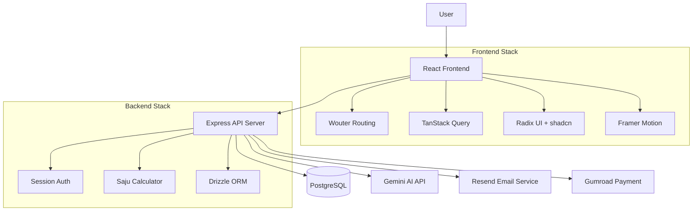
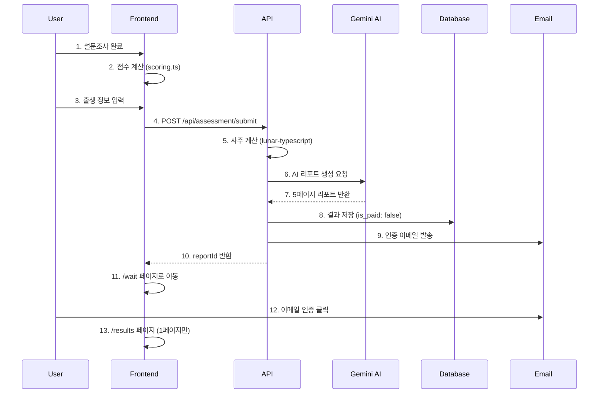

# 🏗️ BADA 시스템 아키텍처

BADA (Operating Pattern Assessment Platform)의 전체 시스템 구조와 기술 스택을 설명합니다.

---

## 📋 개요

BADA는 심리학적 평가와 한국 전통 점성술(사주/사주팔자)을 결합한 자기발견 웹 애플리케이션입니다. 사용자는 8가지 운영 패턴 설문조사를 완료하고 출생 정보를 제공하여 AI가 생성한 개인화된 인사이트를 받습니다.

**핵심 특징:**
- 8문항 성격 분석 설문
- 사주팔자 기반 AI 리포트 생성 
- 오션 테마 디자인 시스템
- 프리미엄 결제 모델 (1페이지 무료, 2-5페이지 유료)

---

## 🏛️ 전체 시스템 구조



---

## 🎨 프론트엔드 아키텍처

### 기술 스택

| 기술 | 역할 | 버전 |
|------|------|------|
| **React** | UI Framework | 18.3.1 |
| **TypeScript** | Type Safety | 5.6.3 |
| **Wouter** | Lightweight Router | 3.3.5 |
| **TanStack Query** | Server State Management | 5.60.5 |
| **Tailwind CSS** | Styling Framework | 3.4.17 |
| **Framer Motion** | Animations | 11.18.2 |
| **Radix UI** | Headless Components | Latest |
| **Vite** | Build Tool | 7.3.0 |

### 주요 패키지

```typescript
// 핵심 의존성 (client/requirements.md 기반)
"framer-motion"    // 부드러운 페이지 전환 및 프로그레스바 애니메이션
"clsx"            // 조건부 className 생성 유틸리티  
"tailwind-merge"  // Tailwind 클래스 안전한 병합
```

### 폴더 구조

```
client/
├── src/
│   ├── components/       # 재사용 가능한 UI 컴포넌트
│   ├── pages/           # 라우트별 페이지 컴포넌트
│   ├── hooks/           # 커스텀 React 훅
│   ├── lib/            # 유틸리티 및 비즈니스 로직
│   │   ├── scoring.ts   # 설문조사 점수 계산 로직
│   │   └── saju_calculator.ts # 사주 계산 로직
│   ├── styles/         # 전역 스타일
│   └── types/          # TypeScript 타입 정의
```

### 디자인 시스템

**오션 테마 컬러 팔레트:**
```css
/* Sky-to-Ocean 그라데이션 */
linear-gradient(
  to bottom,
  hsl(210, 20%, 98%) 0%,    /* Light sky */
  hsl(200, 60%, 90%) 15%,   /* Sky blue */
  hsl(205, 60%, 50%) 30%,   /* Ocean surface */
  hsl(215, 70%, 25%) 50%,   /* Mid depth */
  hsl(222, 50%, 10%) 75%,   /* Deep water */
  hsl(240, 30%, 4%) 100%    /* Abyss */
)
```

**타이포그래피:**
- **본문**: DM Sans (깔끔한 가독성)
- **헤딩/악센트**: Architects Daughter (바다 감성)

**컴포넌트 패턴:**
- **Glass Morphism**: `bg-white/10 backdrop-blur-md border border-white/20`
- **텍스트 대비**: 흰색 텍스트에 opacity 조절 (60%, 80%, 90%)
- **애니메이션**: Framer Motion spring 물리학

---

## 🔧 백엔드 아키텍처

### 기술 스택

| 기술 | 역할 | 버전 |
|------|------|------|
| **Express** | Web Framework | 4.21.2 |
| **TypeScript** | Type Safety | 5.6.3 |
| **Drizzle ORM** | Database ORM | 0.39.3 |
| **PostgreSQL** | Primary Database | - |
| **Passport.js** | Authentication | 0.7.0 |
| **Zod** | Schema Validation | 3.24.2 |

### 핵심 서비스

```typescript
// 주요 모듈
├── routes.ts           // API 엔드포인트
├── storage.ts          // 데이터베이스 연산
├── gemini_client.ts    // AI 리포트 생성
├── saju_calculator.ts  // 사주팔자 계산
├── email_service.ts    // 이메일 발송
└── session.ts          // 세션 관리
```

### 데이터베이스 스키마

```sql
-- 핵심 테이블
leads (
  id uuid PRIMARY KEY,
  email varchar NOT NULL,
  name varchar,
  created_at timestamp
)

saju_results (
  id uuid PRIMARY KEY,
  lead_id uuid REFERENCES leads(id),
  user_input jsonb,        -- 설문 응답 및 출생 정보
  saju_data jsonb,         -- 사주 계산 결과
  report_data jsonb,       -- AI 생성 리포트
  is_paid boolean DEFAULT false,
  created_at timestamp
)
```

---

## 🔄 데이터 플로우

### 사용자 여정



### API 엔드포인트

```typescript
// 주요 API 경로 (shared/routes.ts와 정확히 일치해야 함)
POST   /api/assessment/submit    // 설문 제출 및 리포트 생성
GET    /api/wait/:reportId       // 인증 대기 상태 확인
GET    /api/results/:reportId    // 리포트 조회 (결제 상태에 따라 제한)
POST   /api/verification/resend  // 인증 이메일 재발송
POST   /api/payment/verify       // Gumroad 결제 검증
```

---

## 🧮 사주팔자 계산 엔진

### 핵심 로직

```typescript
// lib/saju_calculator.ts 주요 기능
interface SajuData {
  dayMaster: string;           // 일간 (갑, 을, 병, 정...)
  tenGods: string[];           // 십신 (편관, 정관, 편인...)
  hiddenStems: string[];       // 지장간
  operatingRate: number;       // 운영율 (0-100)
  elementStrength: ElementStrength;
}

// 계산 과정
1. 음력 변환 (lunar-typescript)
2. 사주팔자 도출 (년월일시 기둥)
3. 십신 계산 
4. 지장간 분석
5. 오행 강도 측정
6. 운영율 휴리스틱 계산
```

### 외부 의존성

- **lunar-typescript**: 음력/양력 변환 및 사주 계산
- **city-timezones**: 출생지 시간대 보정
- **geo-tz**: 지리적 시간대 확인

---

## 🤖 AI 리포트 생성

### Gemini API 통합

```typescript
// lib/gemini_client.ts
interface ReportStructure {
  page1: Identity,      // 무료 - "도입부" 역할
  page2: Blueprint,     // 유료 - 자연적 설계도
  page3: OS,           // 유료 - 현재 운영 시스템  
  page4: Tension,      // 유료 - 핵심 긴장 분석
  page5: Protocol      // 유료 - 개인화된 행동 지침
}

// 프롬프트 구조
- 사주 데이터 + 설문 점수 → JSON 스키마 기반 리포트
- 각 페이지별 특정 관점과 톤앤매너
- Identity는 "hook" 역할 (결제 유도)
```

---

## 💳 결제 시스템

### Gumroad 통합

```typescript
// 결제 플로우
1. 사용자가 결제 버튼 클릭
2. Gumroad 체크아웃으로 리다이렉트
3. 결제 완료 후 이메일 매칭으로 검증
4. is_paid 플래그 업데이트
5. 전체 리포트 잠금 해제
```

**중복 제출 방지:**
- 동일 이메일 기존 리포트 확인
- 기존 리포트 있으면 재사용 (Gemini API 비용 절약)
- 새 리포트 생성은 이메일당 1회만

---

## 📧 이메일 시스템

### Resend API 통합

```typescript
// 이메일 템플릿
1. 인증 이메일 - 리포트 링크 포함
2. 결제 후 알림 - 전체 액세스 안내
3. 마케팅 이메일 (동의 시)

// 설정
- 발송자: noreply@yourdomain.com
- 템플릿: HTML + 텍스트 버전
- 추적: 오픈/클릭률 모니터링
```

---

## 🔒 보안 및 인증

### 세션 기반 인증

```typescript
// express-session + PostgreSQL
- 세션 저장소: connect-pg-simple
- CSRF 보호: 토큰 기반
- 비밀번호 없는 인증: 이메일 링크 방식
- 세션 만료: 24시간
```

### 데이터 보호

- **개인정보 암호화**: 출생 정보 등
- **API 제한**: 요청량 제한 (향후)
- **입력 검증**: Zod 스키마 기반
- **XSS 방지**: Content Security Policy

---

## 📊 성능 최적화

### 프론트엔드

```typescript
// 최적화 전략
1. 코드 스플리팅: React.lazy()
2. 이미지 최적화: WebP 포맷
3. 번들 분석: 불필요한 의존성 제거
4. 캐싱: TanStack Query 캐시 전략
5. 애니메이션: Framer Motion 성능 튜닝
```

### 백엔드

```typescript
// 최적화 전략  
1. 데이터베이스 인덱싱: email, reportId 등
2. AI 비용 절약: 중복 리포트 방지
3. 세션 스토어: PostgreSQL 기반
4. 응답 캐싱: Express 미들웨어
5. 백그라운드 작업: 이메일 발송 등
```

---

## 🚀 배포 아키텍처

### 환경 구성

```typescript
// 환경별 설정
Development: 
  - 로컬 PostgreSQL
  - 모크 Gemini API
  - 로컬 이메일 로그

Production:
  - Supabase PostgreSQL  
  - 실제 Gemini API
  - Resend 이메일 서비스
```

### 모니터링

```typescript
// 추적 메트릭
- API 응답 시간
- Gemini API 사용량 및 비용
- 이메일 전송 성공률  
- 결제 전환율
- 오류율 및 로그
```

---

## ⚠️ 알려진 제약사항

### 기술적 한계

1. **AI 응답 시간**: Gemini API 호출에 10-15초 소요
2. **언어 지원**: 현재 한국어만 지원
3. **모바일 최적화**: 반응형이지만 세부 튜닝 필요
4. **오프라인 지원**: 없음 (온라인 전용)

### 확장성 고려사항

1. **AI 비용**: 사용자 증가에 따른 Gemini API 비용 급증 가능
2. **데이터베이스**: 대용량 트래픽 시 인덱싱 및 샤딩 필요
3. **이메일 한도**: Resend 일일 전송 한도 관리 필요

---

## 🔮 향후 개발 방향

### 단기 계획 (다음 스프린트)

- [ ] API 문서 자동 생성 (OpenAPI/Swagger)
- [ ] 에러 추적 시스템 (Sentry)
- [ ] 성능 모니터링 대시보드
- [ ] 백그라운드 작업 큐 시스템

### 중기 계획 (다음 분기)

- [ ] 다국어 지원 (영어, 중국어)
- [ ] 모바일 앱 (React Native)
- [ ] AI 모델 최적화 (비용 절감)
- [ ] 고급 결제 옵션 (구독 모델)

### 장기 계획 (연간)

- [ ] 마이크로서비스 아키텍처 전환
- [ ] 실시간 알림 시스템
- [ ] 머신러닝 기반 개인화
- [ ] 글로벌 CDN 배포

---

## 📚 관련 문서

- **[설정 가이드](SETUP_GUIDE.md)** - 개발 환경 구성 (예정)
- **[API 레퍼런스](API_REFERENCE.md)** - 상세 API 문서 (예정)  
- **[배포 가이드](DEPLOYMENT.md)** - 프로덕션 배포 (예정)
- **[Gumroad 설정](../config/GUMROAD_SETUP.md)** - 결제 연동
- **[결제 시스템](../config/PAYMENT_SETUP.md)** - 결제 로직 상세

---

**마지막 업데이트:** 2026-01-15